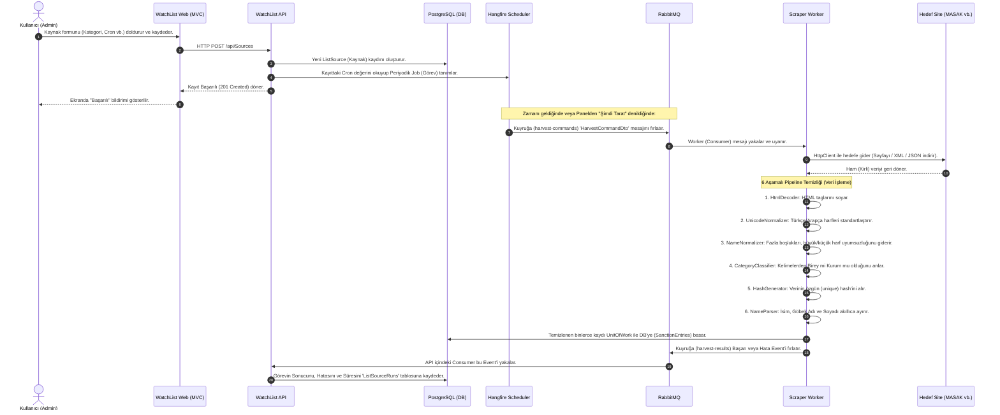
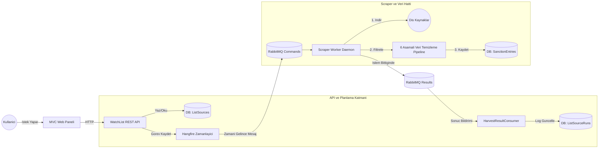

# WatchList Screening Panel 🛡️

**AML (Anti-Money Laundering) Yaptırım Tarama Platformu**

Kişi ve kuruluşları uluslararası yaptırım listelerine karşı tarayan, sonuçları yöneten ve riskli eşleşmeleri izleyen bir compliance aracı.

---

## 🏗️ Mimari

- **Clean Architecture** — Domain → Application → Infrastructure → Presentation
- **ASP.NET Core Web API** — REST API
- **ASP.NET Core MVC** — Admin Panel (Razor + jQuery)
- **Entity Framework Core** — ORM (PostgreSQL)
- **Redis** — Distributed Cache
- **RabbitMQ** — Message Queue (Bulk Screening)
- **Serilog** — Structured Logging
- **Docker Compose** — Container Orchestration

## 📂 Proje Yapısı

```
WatchListScreening/
├── docs/                          # Proje dokümanları
│   ├── 00_PRENSIP_VE_TALIMATLAR.md
│   ├── 01_DOMAIN_BILGISI.md
│   ├── 02_TEKNIK_REFERANS.md
│   ├── 03_VERITABANI_TASARIMI.md
│   ├── 04_FAZ1_GOREVLER.md
│   ├── 05_FAZ2_YOLHARITASI.md
│   └── 06_KOMUT_REFERANSI.md
├── src/
│   ├── WatchListScreening.Domain/
│   ├── WatchListScreening.Application/
│   ├── WatchListScreening.Infrastructure/
│   ├── WatchListScreening.API/
│   └── WatchListScreening.Web/
├── docker-compose.yml
└── WatchListScreening.sln
```

## 🚀 Hızlı Başlangıç

```bash
# 1. Docker servislerini başlat
docker-compose up -d

# 2. Migration uygula
dotnet ef database update -p src/WatchListScreening.Infrastructure -s src/WatchListScreening.API

# 3. API'yi çalıştır
dotnet run --project src/WatchListScreening.API

# 4. Web paneli çalıştır
dotnet run --project src/WatchListScreening.Web --urls "http://localhost:5010"
```

## 📋 Fazlar

## 📋 Fazlar

| Faz | Durum | İçerik |
|---|---|---|
| Faz 1 | 🔄 Tamamlandı | PostgreSQL, tüm modüller, Docker, Temel Mimariler |
| Faz 2 | 🔄 Tamamlandı | ListHarvester (Scraper) Motoru, Hangfire, MassTransit, RabbitMQ, UI Paneli, Uçtan Uca Test |
| Faz 3+ | 💡 Gelecek | ElasticSearch (Tarama Motoru), K8s, CI/CD |

---

## 🗺️ Faz 2: Mimari & Veri Toplama (Scraper) Akışı

Sistem Faz 2 itibarıyla asenkron mikroservis mimarisine geçmiş, **Hangfire** ve **RabbitMQ** ile desteklenmiş sağlam bir **Veri Toplama (Scraper)** motoru kazanmıştır. "En ufak adımına kadar" detaylandırılmış sistem akışı aşağıda hem **Zaman Çizelgesi (Sequence)** hem de **Mimari Şema (Flowchart)** olarak sunulmuştur.

### 1. Sistem İşleyişi (Sequence Diagram - Adım Adım İlişkiler)
Aşağıdaki diyagram, bir yöneticinin kaynak eklemesinden verinin temizlenip kaydedilmesine kadar geçen tüm aşamaları (basit ve karmaşık tüm adımlarıyla) zaman sırasına göre gösterir:



### 2. Mimari Bileşen Şeması (Flowchart)
Sistemin parçalarının birbiriyle fiziksel (altyapısal) ilişkilerini gösteren detaylı harita:


